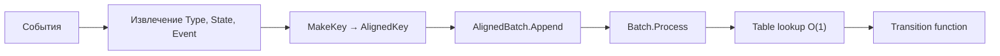

# 📦 cachealign

## Назначение
Оптимизация доступа к памяти для табличной диспетчеризации в высоконагруженных системах.  
Пакет предоставляет компактный ключ `AlignedKey` (4 байта) и выровненный батч `AlignedBatch`, которые минимизируют промахи кэша процессора при последовательном обходе.

[Пример применения](/algo/cachealign/example/main.go)

## Основные типы и методы

### `AlignedKey uint32`
Компактный ключ, собранный из трёх `uint8`-компонентов (тип, состояние, событие).
- **`MakeKey(entityType, state, event uint8) AlignedKey`** – создаёт ключ.

### `AlignedBatch`
Слайс ключей с ёмкостью, кратной 16 (16 × 4 байта = 64 байта = размер кэш-линии).
- **`NewAlignedBatch(capacity int) *AlignedBatch`** – создаёт батч.
- **`Append(key AlignedKey)`** – добавляет ключ.
- **`Process(fn func(key AlignedKey))`** – последовательно обрабатывает все ключи.

## Меры предосторожности
- Ключи должны формироваться из интернированных значений (заранее определённых констант), чтобы избежать аллокаций в куче.
- Выигрыш от выравнивания заметен начиная с 10 000+ ключей в секунду.

## Диаграмма

