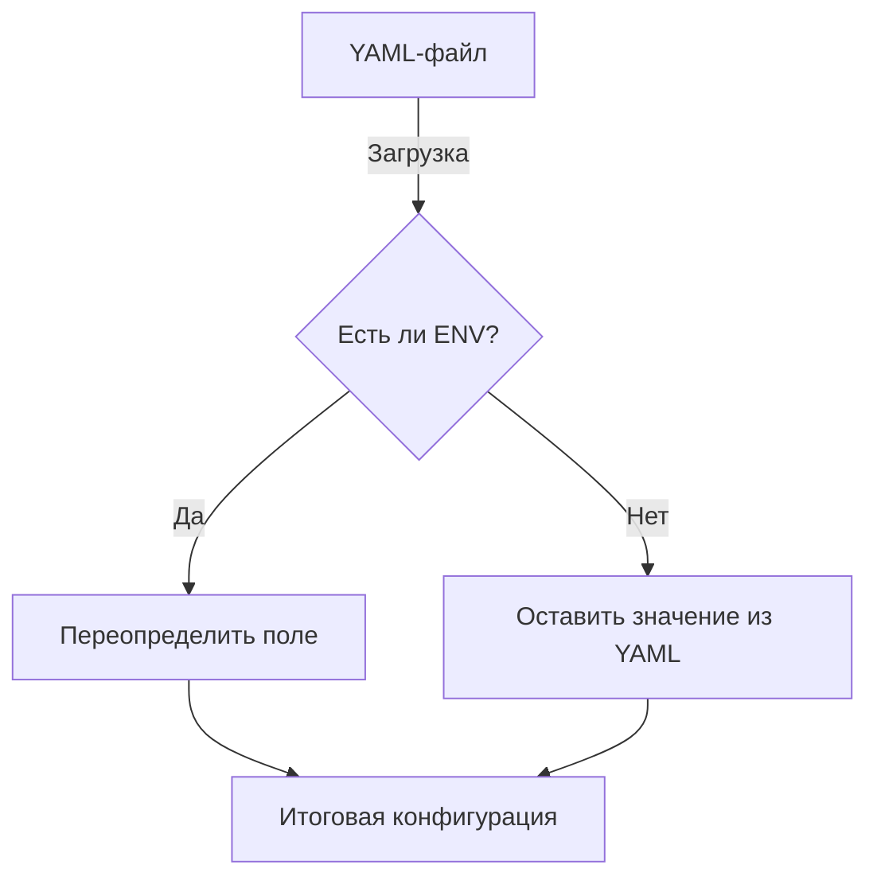

# 📦 config

## Назначение
Загрузка конфигурации из YAML-файлов с возможностью переопределения через переменные окружения. Подходит для любых микросервисов, которым нужно гибко управлять параметрами без пересборки образа.

[Пример применения](/config/example/main.go)

## Основные типы и методы

### `Load(cfg interface{}, opts ...Option) error`
Загружает YAML-файл (по умолчанию `config.yaml`), парсит его в структуру `cfg`, а затем переопределяет поля значениями из переменных окружения.
- `cfg` должен быть **ненулевым указателем на структуру**.
- Поля структуры должны иметь теги `yaml:"field"` и опционально `env:"ENV_NAME"`.

### `Option`
Функциональные опции, передаваемые в `Load`:
- `WithPath(path string)` — путь к YAML-файлу.
- `WithEnvPrefix(prefix string)` — префикс для переменных окружения (по умолчанию пустой).

## Меры предосторожности
- Если YAML-файл не найден, ошибки не будет — конфигурация будет взята только из переменных окружения.
- Типы полей: поддерживаются `string`, `int*`, `uint*`, `float*`, `bool`, `time.Duration`, `[]string` (значения через запятую).
- Имена переменных окружения чувствительны к регистру и должны точно совпадать с суффиксом после префикса.

## Диаграмма приоритета конфигурации

