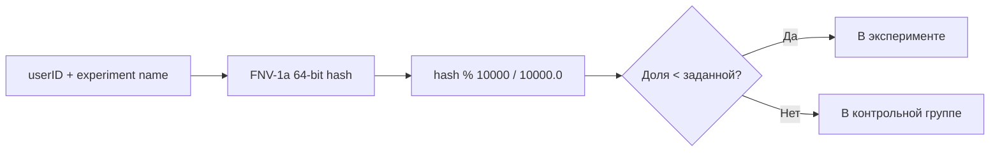

# 📦 experiment

## Назначение
Детерминированное распределение пользователей по A/B‑экспериментам. Позволяет задать процент трафика для каждого эксперимента и проверять, попадает ли конкретный пользователь в экспериментальную группу. Решение основано на хэше от идентификатора пользователя и названия эксперимента, поэтому один и тот же пользователь всегда попадает в одну и ту же группу.

[Пример применения](/data/experiment/example/main.go)

## Основные типы и методы

### `Experiments`
- **`New(flags map[string]float64) *Experiments`** – создаёт набор экспериментов, где ключ – название, значение – доля трафика (0.0–1.0).
- **`IsInExperiment(userID, name string) bool`** – возвращает `true`, если пользователь с данным `userID` попадает в эксперимент `name`. Результат детерминирован.

## Меры предосторожности
- Доля трафика должна быть в диапазоне [0, 1]. Значения вне диапазона корректируются (0 или 1).
- Эксперименты изолированы друг от друга: один пользователь может одновременно участвовать в нескольких экспериментах.

## Диаграмма

