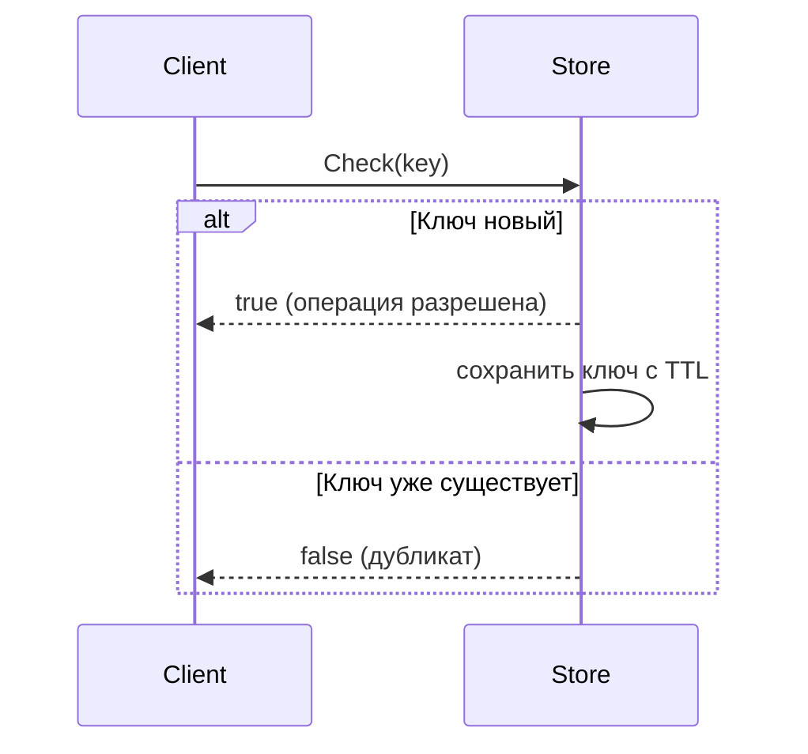

# 📦 idempotent

## Назначение
Гарантия однократной обработки операций. Пакет предоставляет обобщённое хранилище ключей с настраиваемым временем жизни (TTL). Если ключ уже присутствует в хранилище, повторная операция считается дубликатом и отклоняется.

[Пример применения](/data/idempotent/example/main.go)

## Основные типы и методы

### `Store[K comparable]`
- **`NewStore[K comparable](ttl time.Duration) *Store[K]`** – создаёт хранилище с заданным TTL для ключей.
- **`Check(key K) bool`** – возвращает `true`, если ключ новый (операцию можно выполнять), и запоминает его. Возвращает `false`, если ключ уже был использован (дубликат).
- **`Stop()`** – останавливает фоновый процесс очистки истёкших ключей.

## Меры предосторожности
- Ключи автоматически удаляются по истечении TTL, поэтому повторная операция с тем же ключом через TTL будет считаться новой.
- Хранилище потокобезопасно.
- Дженерик `K` позволяет использовать любые сравнимые типы (строки, числа, UUID и т.д.).

## Диаграмма

