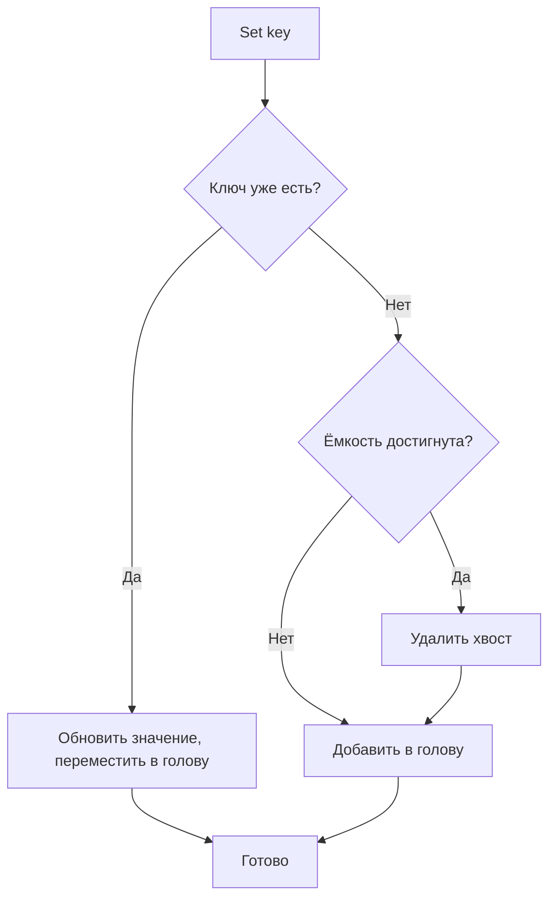

# 📦 lru

## Назначение
Простой и производительный LRU-кеш (Least Recently Used) фиксированной ёмкости. Когда кеш заполнен, при добавлении нового элемента автоматически удаляется тот, к которому дольше всего не обращались. Поддерживает колбэк на вытеснение и потокобезопасен.

[Пример применения](/data/lru/example/main.go)

## Основные типы и методы

### `Cache[K comparable, V any]`
- **`New[K, V](capacity int, opts ...Option[K, V]) *Cache[K, V]`** – создаёт кеш заданной ёмкости.
- **`Get(key K) (V, bool)`** – возвращает значение по ключу и перемещает элемент в голову (делает его самым «свежим»).
- **`Set(key K, value V)`** – добавляет или обновляет значение. Если кеш заполнен, вытесняет наименее используемый элемент.
- **`Extend(key K) bool`** – перемещает элемент в голову, продлевая его «свежесть». Возвращает `false`, если ключ не найден.
- **`Delete(key K)`** – удаляет элемент по ключу.
- **`Len() int`** – возвращает текущее количество элементов.

### Опции
- **`WithEvictCallback[K, V](fn func(key K, value V))`** – задаёт функцию, вызываемую при каждом вытеснении элемента.

## Меры предосторожности
- Ёмкость задаётся при создании и не может быть изменена.
- Кеш не имеет временного TTL — вытеснение только по LRU. Если нужно удаление по времени, используйте `timedcache`.
- Все методы потокобезопасны.

## Диаграмма

