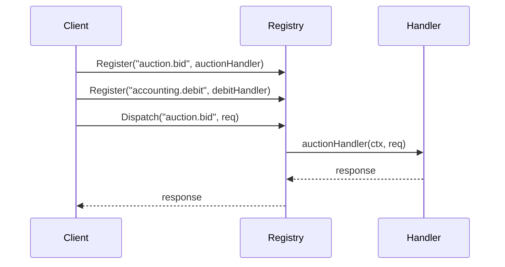

# 📦 registry

## Назначение
Типобезопасный реестр обработчиков, предназначенный для маршрутизации запросов по ключу. Идеально подходит для реализации JSON‑RPC диспетчеров, командных шин или плагинных систем, где каждому имени метода соответствует своя функция-обработчик.

[Пример применения](/data/registry/example/main.go)

## Основные типы и методы

### `Handler[Req, Resp any]`
Функция-обработчик, принимающая контекст и запрос, возвращающая ответ или ошибку.  
```go
type Handler[Req, Resp any] func(ctx context.Context, req Req) (Resp, error)
```

### `Registry[K comparable, Req, Resp any]`
- **`New[K, Req, Resp]() *Registry[K, Req, Resp]`** – создаёт пустой реестр.
- **`Register(key K, h Handler[Req, Resp])`** – регистрирует обработчик для заданного ключа. Если ключ уже существует, обработчик заменяется.
- **`Dispatch(ctx context.Context, key K, req Req) (Resp, error)`** – вызывает обработчик, соответствующий ключу. Возвращает ошибку, если ключ не найден.
- **`Exists(key K) bool`** – проверяет, зарегистрирован ли обработчик для ключа.

## Меры предосторожности
- Ключ `K` должен быть сравнимым типом (`comparable`).
- Обработчики должны быть потокобезопасными, если реестр используется конкурентно (сам реестр защищён `sync.RWMutex`).
- При вызове `Dispatch` с несуществующим ключом возвращается ошибка, а не паника.

## Диаграмма

