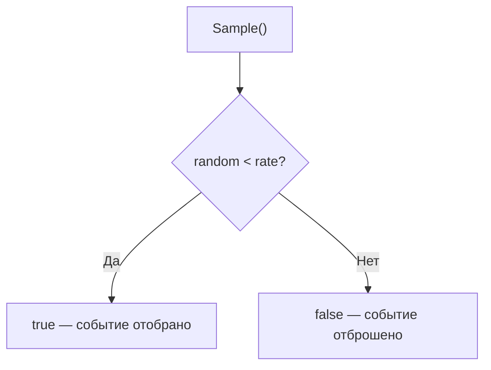

# 📦 sampler

## Назначение
Вероятностный сэмплер для снижения нагрузки на системы логирования, аналитики или трассировки. Позволяет случайным образом отбирать долю событий, сохраняя репрезентативность выборки.

[Пример применения](/data/sampler/example/main.go)

## Основные типы и методы

### `Sampler`
- **`NewSampler(rate float64) *Sampler`** – создаёт сэмплер, который будет возвращать `true` с вероятностью `rate` (от 0 до 1).
- **`Sample() bool`** – возвращает `true` с заданной вероятностью. Может вызываться из многих горутин одновременно.

## Меры предосторожности
- Вероятность строго ограничена диапазоном [0, 1]. Значения вне диапазона корректируются.
- Сэмплер использует внутренний генератор случайных чисел с мьютексом, поэтому безопасен для конкурентного использования.
- Не гарантирует точное количество сэмплов за фиксированный интервал – только вероятностное распределение.

## Диаграмма

