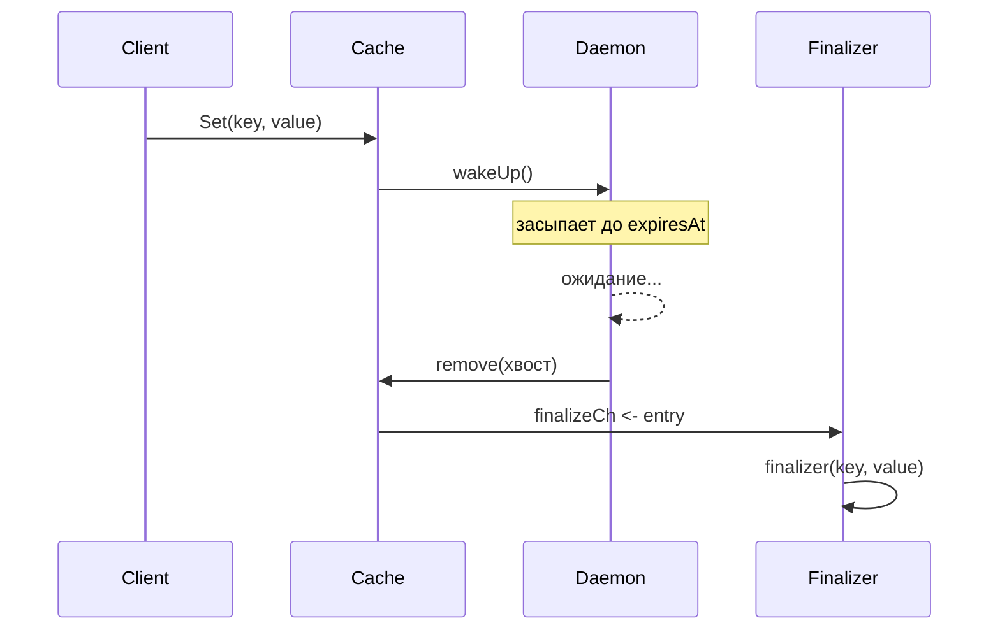

# 📦 timedcache

## Назначение
Потокобезопасный in‑memory кеш с точным временем жизни (TTL) для каждого элемента. Элементы автоматически удаляются ровно в момент истечения TTL. Поддерживает настраиваемый финализатор, который вызывается при удалении, и пул воркеров для его выполнения.

[Пример применения](/data/timedcache/example/main.go)

## Основные типы и методы

### `Cache[K comparable, V any]`
- **`New[K, V](ttl time.Duration, opts ...Option[K, V]) *Cache[K, V]`** – создаёт кеш с заданным TTL.
- **`Get(key K) (V, bool)`** – возвращает значение, если ключ существует и не просрочен. При успешном доступе TTL продлевается.
- **`Set(key K, value V)`** – добавляет или обновляет значение. TTL сбрасывается.
- **`Extend(key K) bool`** – продлевает время жизни элемента, не изменяя его значение. Возвращает `false`, если ключ не найден.
- **`Delete(key K)`** – немедленно удаляет элемент.
- **`Stop()`** – останавливает демон очистки и воркеры финализатора. После вызова `Stop` кеш нельзя использовать.

### Опции
- **`WithFinalizer[K, V](fn func(key K, value V))`** – задаёт функцию, вызываемую при каждом удалении элемента (как по истечении TTL, так и при явном `Delete`).
- **`WithFinalizerWorkers[K, V](n int)`** – количество горутин, обрабатывающих финализатор (по умолчанию 4).
- **`WithFinalizerBuffer[K, V](size int)`** – размер буфера канала финализатора (по умолчанию 256).
- **`WithNowFunc[K, V](fn func() time.Time)`** – подмена источника времени (полезно для тестов).

## Меры предосторожности
- Финализатор выполняется **асинхронно** в отдельных горутинах. Не блокируйте его надолго.
- Демон автоматически засыпает до ближайшего истечения, поэтому кеш не тратит ресурсы в простое.
- После вызова `Stop()` кеш становится непригодным для использования.

## Диаграмма

