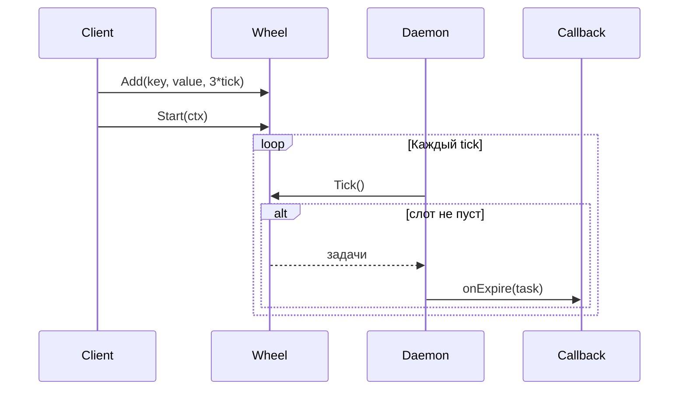

# 📦 timewheel

## Назначение
Обобщённое колесо времени для планирования задач с произвольной задержкой. Позволяет добавлять задачи, продлевать или отменять их, а при наступлении заданного срока — автоматически вызывать колбэк. Эффективно обрабатывает миллионы таймеров за счёт группировки по временным слотам и быстрой проверки заполненности через битовую маску.

[Пример применения](/data/timewheel/example/main.go)

## Основные типы и методы

### `TimeWheel[K comparable, T any]`
- **`New[K, T](tick time.Duration, numSlots int, opts ...Option[K, T]) *TimeWheel[K, T]`** – создаёт колесо с заданным шагом `tick` и количеством слотов. Общий охват по времени = `tick * numSlots`.
- **`Add(key K, value T, delay time.Duration) time.Time`** – добавляет задачу, которая будет выполнена через `delay`. Возвращает ожидаемое время срабатывания.
- **`Move(key K, newDelay time.Duration) time.Time`** – переносит существующую задачу на новое время. Если ключ не найден, создаёт новую задачу (значение будет zero-value).
- **`MoveValue(key K, value T, newDelay time.Duration) time.Time`** – переносит задачу и одновременно обновляет связанное значение.
- **`Remove(key K)`** – отменяет задачу.
- **`Tick() []Task[K, T]`** – ручное продвижение стрелки на один слот. Возвращает все задачи, попавшие в текущий слот.
- **`Start(ctx context.Context)`** – запускает демона, который автоматически вызывает `Tick` и передаёт истёкшие задачи в колбэк `onExpire`.
- **`Stop()`** – останавливает демона.

### Опции
- **`WithExpireCallback[K, T](cb func(task Task[K, T]))`** – задаёт колбэк, вызываемый при истечении задачи (только при использовании `Start`).

## Меры предосторожности
- Вместимость колеса ограничена `tick * numSlots`. Задачи с задержкой, превышающей этот период, необходимо обрабатывать отдельно (например, с помощью иерархических колёс).
- `Add` с уже существующим ключом удаляет старую задачу и создаёт новую.
- Колбэк `onExpire` вызывается **синхронно** в горутине демона, поэтому не должен блокироваться надолго.

## Диаграмма

