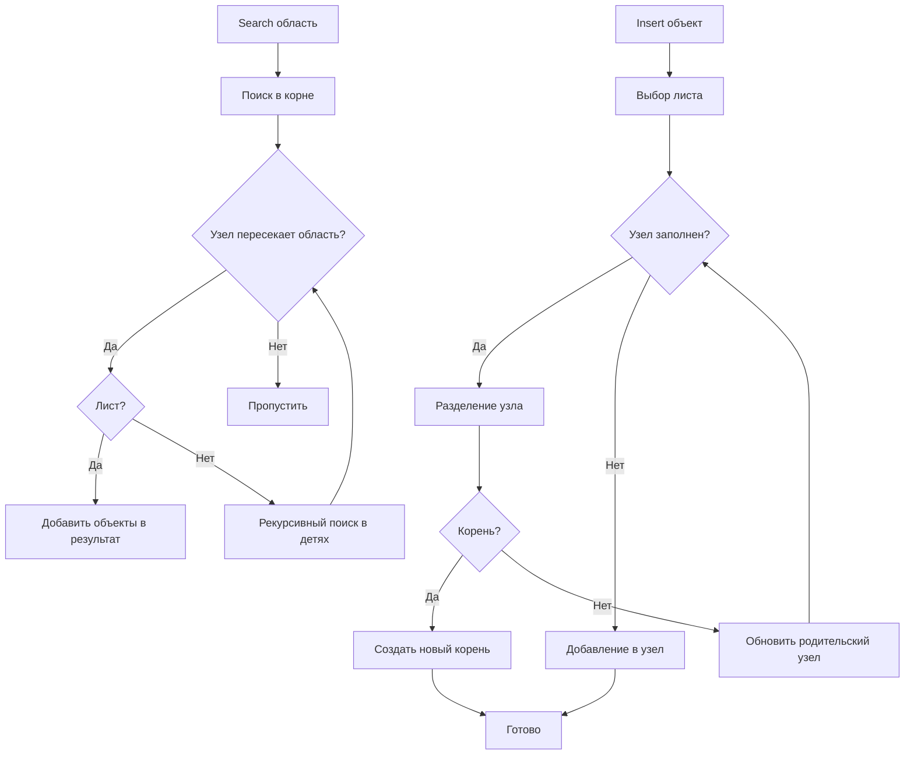

# 📦 geospatial

## Назначение
Геопространственные вычисления и индексация объектов на карте. Пакет предоставляет базовые геометрические предикаты (расстояние Хаверсина, проверка точки в полигоне), а также высокопроизводительное R‑дерево для быстрого поиска объектов по области или ближайших соседей.

[Пример применения](/geo/geospatial/example/main.go)

## Основные типы и методы

### Точка и ограничивающий прямоугольник
- **`Point{Lat, Lng float64}`** – географическая координата в градусах.
- **`BBox{MinLat, MinLng, MaxLat, MaxLng float64}`** – прямоугольная область.

### Геометрические функции
- **`HaversineDistance(a, b Point) float64`** – расстояние между точками в метрах по формуле Хаверсина.
- **`PointInPolygon(pt Point, polygon []Point) bool`** – проверяет, лежит ли точка внутри простого (несамопересекающегося) многоугольника. Многоугольник должен быть замкнут (первая и последняя вершины совпадают).

### R‑дерево
- **`NewRTree[T any](maxEntries int) *RTree[T]`** – создаёт дерево с максимальным количеством элементов в узле (обычно 16–64).
- **`Insert(bbox BBox, value T)`** – добавляет объект с его ограничивающим прямоугольником.
- **`Search(query BBox) []T`** – возвращает все объекты, чьи прямоугольники пересекаются с `query`.
- **`Nearest(point Point, k int) []T`** – возвращает до `k` ближайших к точке объектов.
- **`Size() int`** – количество объектов в дереве.

## Меры предосторожности
- `PointInPolygon` работает только с простыми многоугольниками. Самопересекающиеся полигоны дадут неверный результат.
- R‑дерево не является потокобезопасным. Если требуется конкурентный доступ, оберните вызовы в мьютекс.
- R‑дерево оптимизировано для тысяч и миллионов объектов. Для малых наборов (до ~50) простой перебор может быть быстрее.

## Диаграмма работы R‑дерева

