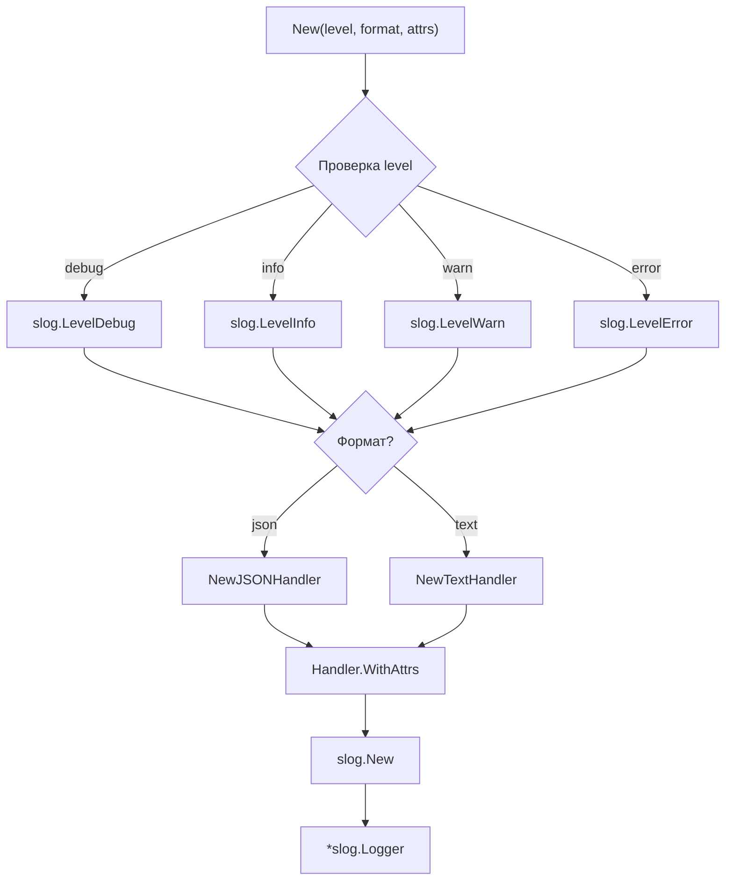

# 📦 logger

## Назначение
Быстрое создание структурированного логгера на базе стандартного `log/slog`.  
Пакет скрывает настройку обработчика и позволяет единообразно задавать уровень, формат и атрибуты, которые автоматически добавляются в каждую запись.

[Пример применения](/logger/example/main.go)

## Основные типы и методы

### `New(level, format string, attrs ...slog.Attr) *slog.Logger`
Создаёт новый экземпляр `*slog.Logger`.

**Параметры:**
- `level` – минимальный уровень логирования: `"debug"`, `"info"`, `"warn"`, `"error"`.
- `format` – формат вывода: `"json"` или `"text"`.
- `attrs` – дополнительные атрибуты, которые будут добавляться в каждую запись (например, `slog.String("service", "myapp")`).

Возвращаемый логгер можно сразу использовать для записи событий.

## Меры предосторожности
- Уровни и формат проверяются во время выполнения; неверные значения заменяются на `"info"` и `"text"` соответственно.
- Логгер пишет в `os.Stdout`. При необходимости перенаправления используйте `slog.New(handler)` вручную.
- Созданный логгер потокобезопасен и может использоваться глобально.

## Диаграмма

