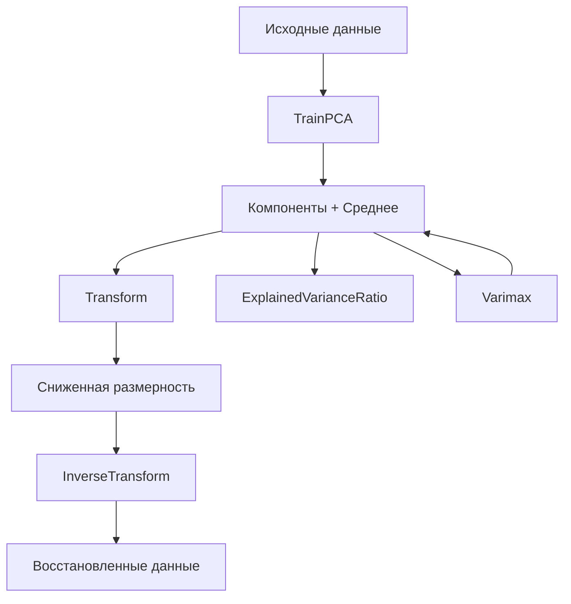

# 📦 factoranalysis

## Назначение
Методы многомерного анализа данных: метод главных компонент (PCA) с опциональным вращением Varimax. Позволяет снижать размерность данных, выделять наиболее влиятельные факторы и визуализировать многомерные наборы в 2D/3D.

[Пример применения](/math/factoranalysis/example/main.go)

## Основные типы и методы

### `PCA`
- **`TrainPCA(X [][]float64, nComponents int) (*PCA, error)`** – обучает модель PCA на матрице `X` (объекты × признаки) и выделяет заданное количество главных компонент.
- **`Transform(X [][]float64) [][]float64`** – проецирует данные на пространство главных компонент (уменьшение размерности).
- **`InverseTransform(Z [][]float64) [][]float64`** – восстанавливает исходные данные из проекции (с потерями).
- **`ExplainedVarianceRatio() []float64`** – возвращает долю объяснённой дисперсии для каждой компоненты.
- **`Varimax(gamma float64, maxIter int) *PCA`** – вращает компоненты для улучшения интерпретируемости.

## Меры предосторожности
- Данные автоматически центрируются (вычитается среднее).
- Количество компонент не может превышать количество признаков.
- `Varimax` — итеративный алгоритм; `gamma` задаёт порог сходимости (обычно 1e‑6), `maxIter` — максимальное число итераций.
- Для очень больших матриц лучше использовать стохастические или онлайн‑алгоритмы PCA.

## Диаграмма

