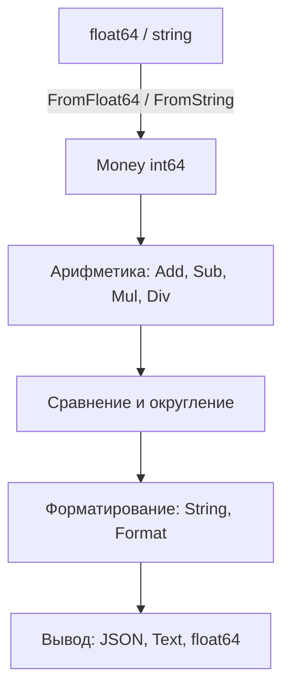

# 📦 fixedpoint

## Назначение
Точная денежная арифметика без ошибок округления. Все значения хранятся в минимальных денежных единицах (копейках, центах) как `int64`, а масштаб указывает количество знаков после запятой. Пакет незаменим в финансовых расчётах, биллинге и любых системах, где `float64` недопустим.

[Пример применения](/math/fixedpoint/example/main.go)

## Основные типы и методы

### `Money`
```go
type Money struct {
    amount int64
    scale  int32
}
```

### Конструкторы
- **`New(amount int64, scale int32) Money`** – создаёт значение из минимальных единиц.
- **`FromFloat64(value float64, scale int32) Money`** – создаёт из `float64` с округлением.
- **`FromString(s string, scale int32) (Money, error)`** – парсит строку, например `"100.50"`.
- **`Zero(scale int32) Money`** – ноль заданного масштаба.

### Арифметика
- **`Add(other Money) (Money, error)`**, **`Sub(other Money) (Money, error)`** – сложение и вычитание (масштабы должны совпадать).
- **`Mul(factor int64) Money`**, **`Div(divisor int64) (Money, error)`** – умножение и деление на целое.
- **`MulFloat(factor float64) Money`**, **`DivFloat(divisor float64) Money`** – умножение и деление на float с округлением.
- **`AddChecked`, `SubChecked`, `MulChecked`** – операции с проверкой переполнения.

### Сравнение и округление
- **`Cmp(other Money) int`** – -1, 0, 1.
- **`Equals`, `LessThan`, `GreaterThan`, `IsZero`, `Sign`, `Abs`**.
- **`Round(minUnit int64) Money`** – округление до заданного шага.
- **`Ceil()`, `Floor()`, `Trunc()`** – округление до целых единиц валюты.

### Форматирование и сериализация
- **`String() string`**, **`Format(decimals int32) string`**, **`Float64() float64`**.
- **`MarshalJSON`, `UnmarshalJSON`, `MarshalText`, `UnmarshalText`**.

### Конвертация и агрегация
- **`Convert(rate float64, targetScale int32) Money`** – пересчёт по курсу.
- **`Sum(values []Money) (Money, error)`**, **`Avg(values []Money) (Money, error)`**.

## Меры предосторожности
- Все операции со смешанными масштабами возвращают ошибку `"scale mismatch"`.
- `Float64()` предназначен **только для отображения**; не используйте его в вычислениях.
- `FromFloat64` округляет до ближайшего целого, что может дать погрешность в 1 минимальную единицу.

## Диаграмма

