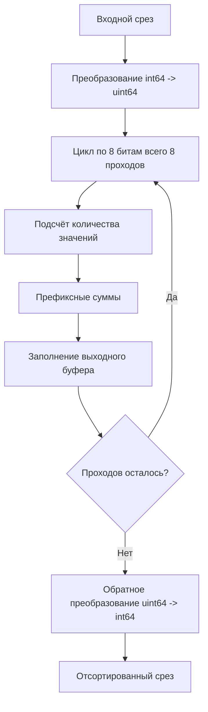

# 📦 radixsort

## Назначение
Высокопроизводительная поразрядная сортировка (LSD Radix Sort) для целочисленных типов и `float64`. Работает за линейное время O(N), что значительно быстрее стандартного `sort.Slice` (O(N log N)) на больших массивах. Поддерживает сортировку с синхронной перестановкой индексов.

[Пример применения](/math/radixsort/example/main.go)

## Основные типы и методы

- **`SortInt64(data []int64)`** – сортирует срез `int64` по возрастанию.
- **`SortInt64WithIndices(data []int64, indices []int)`** – сортирует `data` и одновременно переставляет элементы `indices` в том же порядке. Полезно, когда нужно сохранить исходные позиции элементов.
- **`SortUint64(data []uint64)`** – сортирует срез `uint64`.
- **`SortFloat64(data []float64)`** – сортирует срез `float64`. Сначала преобразует числа в их целочисленное представление, сохраняющее порядок.

## Меры предосторожности
- Все функции работают **in‑place** и **не являются потокобезопасными**.
- Алгоритм использует временный буфер размером O(N). Для очень больших массивов (сотни мегабайт) убедитесь, что доступно достаточно памяти.
- Сортировка `float64` корректно обрабатывает отрицательные значения, `NaN` и `±Inf`.

## Диаграмма

