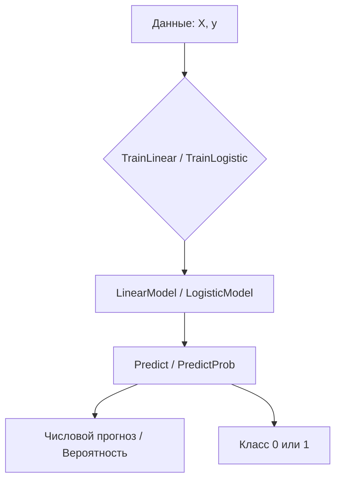

# 📦 regression

## Назначение
Линейная и логистическая регрессия для прогнозирования числовых значений и бинарной классификации. Пакет предоставляет обучение моделей (Ordinary Least Squares для линейной, градиентный спуск для логистической) и быстрое, без выделений памяти, предсказание.

[Пример применения](/math/regression/example/main.go)

## Основные типы и методы

### `LinearModel`
- **`TrainLinear(X [][]float64, y []float64) (*LinearModel, error)`** – обучает линейную регрессию методом наименьших квадратов. `X` — матрица «объекты × признаки», `y` — целевые значения.
- **`Predict(features []float64) float64`** – возвращает предсказанное значение по вектору признаков (интерсепт + линейная комбинация).

### `LogisticModel`
- **`TrainLogistic(X [][]float64, y []float64, learningRate float64, iterations int) (*LogisticModel, error)`** – обучает логистическую регрессию градиентным спуском.
- **`PredictProb(features []float64) float64`** – вероятность положительного класса (сигмоида от линейной комбинации).
- **`PredictClass(features []float64, threshold float64) int`** – класс 0 или 1 на основе порога (по умолчанию 0.5).

## Меры предосторожности
- Размерность признаков должна совпадать во время обучения и предсказания.
- Для `TrainLinear` матрица `X^T X` должна быть обратима. В случае вырожденной матрицы возвращается ошибка `"singular matrix"`.
- `TrainLogistic` выполняет заданное количество итераций; подбор `learningRate` и `iterations` влияет на сходимость.
- Методы `Predict` и `PredictProb` **не выделяют память в куче** и безопасны для частых вызовов.

## Диаграмма

