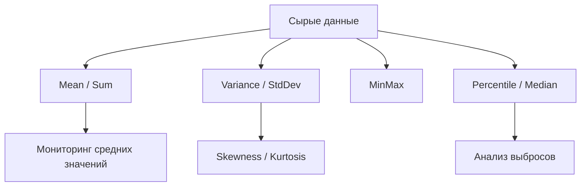

# 📦 statistics

## Назначение
Базовые статистические функции для анализа данных. Пакет предоставляет чистое Go‑решение без внешних зависимостей, оптимизированное для производительности и минимальных аллокаций в горячем пути.

[Пример применения](/math/statistics/example/main.go)

## Основные типы и методы

- **`Mean(values []float64) float64`** – среднее арифметическое.
- **`Variance(values []float64) float64`** – популяционная дисперсия.
- **`StdDev(values []float64) float64`** – стандартное отклонение.
- **`Covariance(x, y []float64) float64`** – выборочная ковариация.
- **`Correlation(x, y []float64) float64`** – коэффициент корреляции Пирсона.
- **`Percentile(values []float64, p float64) float64`** – процентиль с линейной интерполяцией.
- **`Median(values []float64) float64`** – медиана (50‑й процентиль).
- **`MinMax(values []float64) (min, max float64)`** – минимум и максимум.
- **`Sum(values []float64) float64`** – сумма.
- **`Skewness(values []float64) float64`** – асимметрия выборки.
- **`Kurtosis(values []float64) float64`** – эксцесс выборки.
- **`Entropy(probs []float64) float64`** – энтропия Шеннона.
- **`Normalise(values []float64) []float64`** – z‑score нормализация.

## Меры предосторожности
- Все функции ожидают `[]float64`. Пустой слайс или недостаточная длина (например, для дисперсии нужно ≥2) возвращают 0 без паники.
- `Covariance` и `Correlation` требуют слайсы одинаковой длины; иначе возвращают 0.
- `Percentile` сортирует копию данных, поэтому имеет сложность O(N log N). Для частых вызовов на больших массивах используйте аппроксимации.

## Диаграмма

