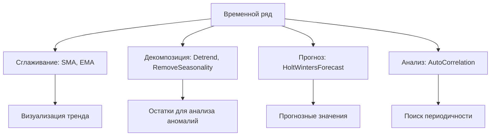

# 📦 timeseries

## Назначение
Функции для анализа и прогнозирования временных рядов: экспоненциальное сглаживание Хольт‑Уинтерса, скользящие средние, удаление тренда и сезонности, автокорреляция. Всё реализовано на чистом Go без внешних зависимостей.

[Пример применения](/math/timeseries/example/main.go)

## Основные типы и методы

### `HoltWintersParams`
- **`Alpha, Beta, Gamma float64`** – коэффициенты сглаживания (0–1).
- **`Period int`** – длина сезонного цикла (0 – несезонная модель).

### Прогнозирование
- **`HoltWintersForecast(data []float64, horizon int, params HoltWintersParams) ([]float64, error)`** – выполняет тройное экспоненциальное сглаживание и возвращает прогноз на `horizon` точек.

### Сглаживание
- **`SimpleMovingAverage(data []float64, window int) []float64`** – простое скользящее среднее.
- **`ExponentialMovingAverage(data []float64, alpha float64) []float64`** – экспоненциальное скользящее среднее.

### Декомпозиция
- **`LinearDetrend(data []float64) (detrended []float64, intercept, slope float64)`** – удаляет линейный тренд методом наименьших квадратов.
- **`RemoveSeasonality(data []float64, period int) (deseasonalized, seasonal []float64)`** – вычитает средний сезонный профиль.

### Анализ
- **`AutoCorrelation(data []float64, maxLag int) []float64`** – автокорреляционная функция (ACF) до заданного лага.

## Меры предосторожности
- Для сезонной модели Хольт‑Уинтерса требуется минимум `2 * Period` точек данных; иначе автоматически применяется несезонная модель.
- `LinearDetrend` использует простую линейную регрессию на индекс; для нелинейных трендов результат будет приближённым.
- Все функции возвращают новые слайсы, не изменяя исходные данные.

## Диаграмма

