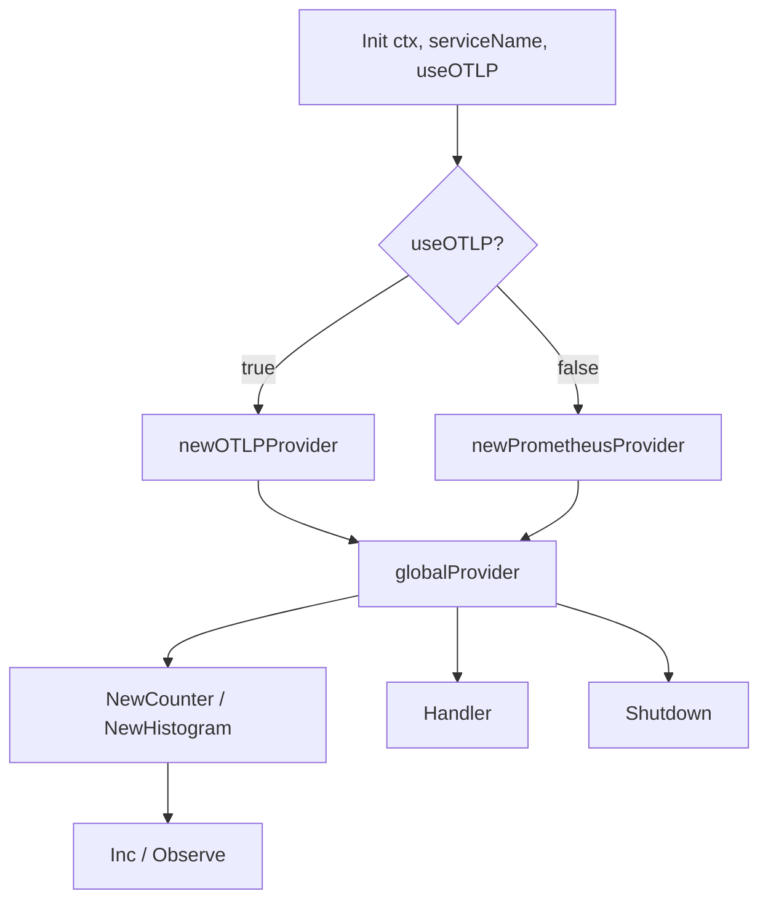

# 📦 metrics

## Назначение
Единый интерфейс для сбора метрик с поддержкой двух бэкендов:
- **Prometheus** – текстовая выдача метрик по HTTP для локального мониторинга и Grafana.
- **OpenTelemetry (OTLP)** – отправка метрик в коллектор (например, Jaeger, Prometheus, Cloud Monitoring) для production-окружений.

Пакет скрывает детали инициализации и позволяет в рантайме переключаться между бэкендами без изменения кода сбора метрик.

[Пример применения](/metrics/example/main.go)

## Основные типы и методы

### `Init(ctx context.Context, serviceName string, useOTLP bool) error`
Инициализирует глобальный провайдер метрик.
- `serviceName` – имя сервиса, используется в OTLP как атрибут ресурса.
- `useOTLP` – если `true`, подключается OTLP-экспортёр; иначе – Prometheus.

### `NewCounter(name, help string, labels []string) Counter`
Создаёт счётчик (монотонно возрастающая метрика).
- `name` – имя метрики (например, `"requests_total"`).
- `help` – описание метрики.
- `labels` – список имён меток (например, `[]string{"method"}`).

### `NewHistogram(name, help string, buckets []float64, labels []string) Histogram`
Создаёт гистограмму (распределение значений).
- `buckets` – границы интервалов (например, `[]float64{0.01, 0.05, 0.1, 0.5, 1}`).

### `Handler() http.Handler`
Возвращает HTTP-обработчик для экспонирования метрик (в Prometheus-режиме отдаёт `/metrics`). В OTLP-режиме возвращает `404`.

### `Shutdown(ctx context.Context) error`
Корректно завершает работу провайдера (сбрасывает буферы, закрывает соединения).

## Меры предосторожности
- `Init` должен быть вызван **один раз** при старте сервиса, до создания метрик.
- Счётчики и гистограммы **потокобезопасны**.
- В OTLP-режиме необходимо настроить коллектор и переменные окружения (`OTEL_EXPORTER_OTLP_ENDPOINT` и т.п.).

## Диаграмма

