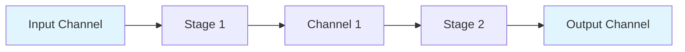

# 📦 backpressure

## Назначение
Высокопроизводительный конвейер (Pipeline) с настраиваемым параллелизмом и встроенным обратным давлением. Когда каналы между стадиями заполнены, отправитель автоматически блокируется, предотвращая переполнение и неконтролируемый рост памяти.

[Пример применения](/net/backpressure/example/main.go)

## Основные типы и методы

### `Stage[T any]`
Функция-стадия, принимающая элемент и возвращающая ошибку. При ненулевой ошибке конвейер прерывается.  
```go
type Stage[T any] func(ctx context.Context, item T) error
```

### `Pipeline[T any]`
- **`NewPipeline[T](stages []Stage[T], opts ...Option[T]) *Pipeline[T]`** – создаёт конвейер из последовательности стадий.
- **`Run() (input chan<- T, output <-chan T)`** – запускает конвейер и возвращает канал для отправки данных и канал для чтения результатов.
- **`Wait()`** – блокируется до завершения всех стадий.

### Опции
- **`WithWorkers[T](workers int)`** – задаёт количество горутин для каждой стадии (по умолчанию 1).
- **`WithBufferSize[T](size int)`** – задаёт ёмкость каналов между стадиями (по умолчанию 0 – небуферизированный).

## Меры предосторожности
- Каждая стадия работает в нескольких горутинах. Функции стадий должны быть потокобезопасны или принимать только копии данных.
- При ошибке любой стадии конвейер завершается через отмену контекста.
- После закрытия входного канала конвейер корректно завершает все стадии и закрывает выходной канал.

## Диаграмма

