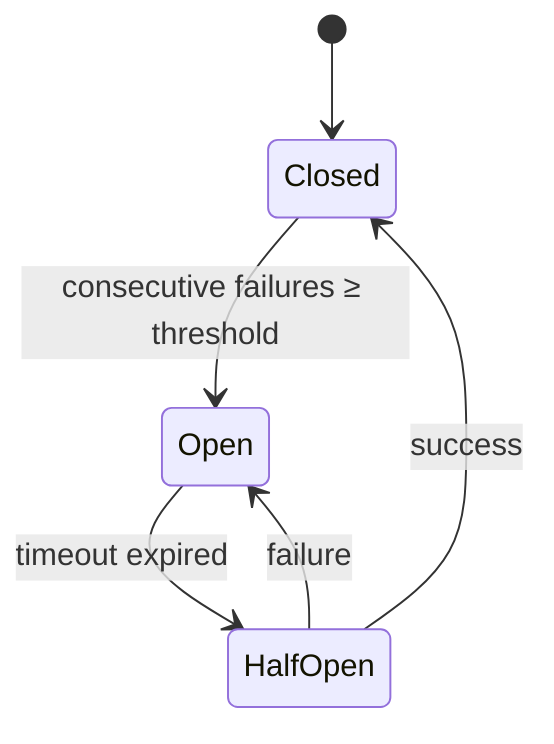

# 📦 breaker

## Назначение
Защита внешних вызовов от каскадных отказов с помощью паттерна Circuit Breaker. Автоматически размыкает цепь при превышении порога последовательных ошибок и замыкает обратно после успешного пробного запроса.

[Пример применения](/net/breaker/example/main.go)

## Основные типы и методы

### `Breaker`
- **`New(name string, threshold int, timeout time.Duration) *Breaker`** – создаёт Circuit Breaker с заданным именем, порогом ошибок и таймаутом разомкнутого состояния.
- **`Execute(ctx context.Context, fn func() error) error`** – выполняет функцию `fn`, если цепь замкнута. При разомкнутой цепи сразу возвращает `ErrCircuitOpen`.
- **`State() State`** – возвращает текущее состояние: `Closed`, `Open` или `HalfOpen`.
- **`Reset()`** – принудительно замыкает цепь (сбрасывает счётчик ошибок).

### Состояния
- **Closed** – нормальная работа, все запросы проходят.
- **Open** – цепь разомкнута, запросы немедленно отклоняются.
- **HalfOpen** – разрешён один пробный запрос. Если он успешен – цепь замыкается, если нет – снова размыкается.

## Меры предосторожности
- Порог ошибок считается **подряд** (consecutive failures). Один успех сбрасывает счётчик.
- Таймаут начинает отсчитываться с момента последней ошибки, а не с момента размыкания.
- `Execute` потокобезопасен, но при высокой конкуренции в HalfOpen может пройти несколько пробных запросов.

## Диаграмма

