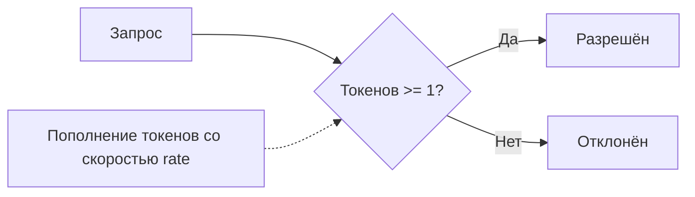
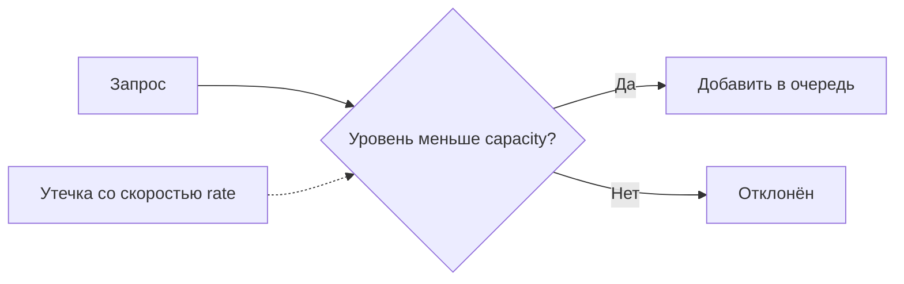
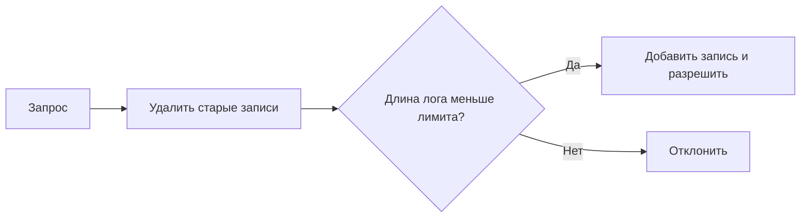
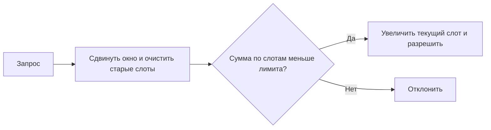
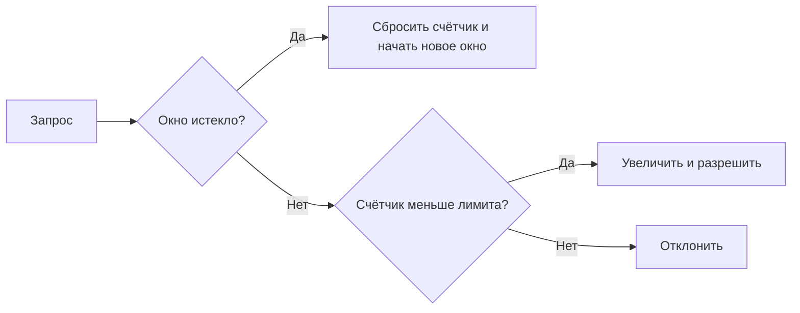

# 📦 ratelimit

## Назначение
Набор алгоритмов ограничения скорости (rate limiting) для защиты сервисов от перегрузок. Пакет предоставляет несколько независимых реализаций, каждая из которых подходит для своего сценария, а также обобщённый `KeyedLimiter` для ограничений по ключу (например, IP-адресу).

[Пример применения](/net/ratelimit/example/main.go)

## Алгоритмы

### Token Bucket (рекомендуемый)
Классический алгоритм с «ведром токенов». Позволяет кратковременные бёрсты (до размера ведра) и ограничивает среднюю скорость.
- **`NewTokenBucket(rate, burst float64) *TokenBucket`** – `rate` токенов/сек, `burst` – максимальный запас.
- **`Allow()` / `AllowN(n float64) bool`** – разрешить запрос, если достаточно токенов.

### Leaky Bucket
«Дырявое ведро» – запросы просачиваются с фиксированной скоростью. Избыток отбрасывается.
- **`NewLeakyBucket(rate, capacity float64) *LeakyBucket`**
- **`Allow() bool`**

### Sliding Window Log
Точный алгоритм на основе лога временных меток. Гарантирует строгое соблюдение лимита в любой момент окна, но требует памяти под каждую запись.
- **`NewSlidingWindowLog(limit int, window time.Duration) *SlidingWindowLog`**
- **`Allow() bool`**

### Sliding Window Counter
Приближённый, но очень эффективный по памяти алгоритм. Делит окно на слоты и считает запросы в каждом слоте.
- **`NewSlidingWindowCounter(limit int, window time.Duration, slots int) *SlidingWindowCounter`**
- **`Allow() bool`**

### Fixed Window
Самый простой алгоритм: счётчик сбрасывается через фиксированный интервал. Подвержен эффекту удвоенной нагрузки на стыке окон.
- **`NewFixedWindow(limit int, window time.Duration) *FixedWindow`**
- **`Allow() bool`**

## KeyedLimiter
Позволяет создавать независимые лимитеры для разных ключей (например, IP-адресов клиентов).
- **`NewKeyedLimiter(factory func() Limiter) *KeyedLimiter`** – фабрика создаёт новый лимитер для каждого ключа.
- **`Allow(key string) bool`** – проверяет, разрешён ли запрос для данного ключа.

## Меры предосторожности
- Все алгоритмы потокобезопасны.
- `SlidingWindowLog` хранит временные метки всех запросов в окне, что может быть затратно при высоком трафике.
- `FixedWindow` не рекомендуется для точных ограничений из-за граничного эффекта.
- `KeyedLimiter` не удаляет старые лимитеры для ключей, которые перестали использоваться (потенциальная утечка памяти при неограниченном наборе ключей).