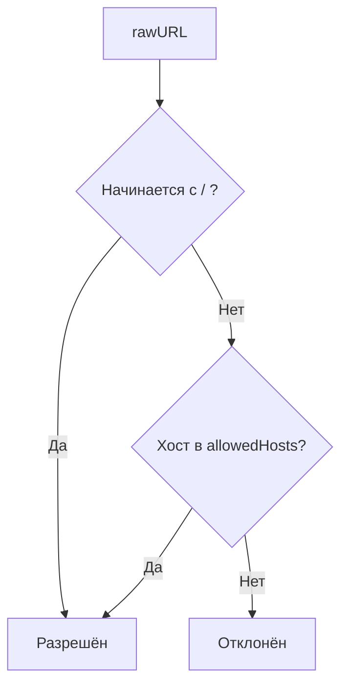

# 📦 appsec

## Назначение
Лёгкие, не требующие внешних зависимостей инструменты для защиты веб‑приложений: безопасные редиректы, санитизация HTML от XSS, HMAC‑подпись URL‑параметров и валидация пользовательского ввода.

[Пример применения](/security/appsec/example/main.go)

## Основные типы и методы

### Безопасный редирект
- **`SafeRedirect(rawURL string, allowedHosts []string) (string, error)`** – проверяет, что URL ведёт на разрешённый хост. Относительные пути (начинающиеся с `/`) считаются безопасными.

### Защита от XSS
- **`SanitizeHTML(input string) string`** – удаляет опасные HTML‑теги (`<script>`, `<iframe>` и др.) и атрибуты обработчиков событий (`onclick`, `onerror` и т.д.).

### Подпись URL
- **`SignURLParams(baseURL string, params map[string]string, secret []byte) (string, error)`** – добавляет к URL параметр `sig` с HMAC‑SHA256 подписью.
- **`VerifyURLParams(fullURL string, secret []byte) (url.Values, error)`** – проверяет подпись и возвращает параметры, если она верна.

### Валидация ввода
- **`ValidID(id string) bool`** – строка содержит только `[a-zA-Z0-9_-]`.
- **`ValidNumber(s string) bool`** – строка состоит только из цифр.

## Меры предосторожности
- `SanitizeHTML` – базовая защита, не заменяет полноценные библиотеки типа bluemonday для сложных сценариев.
- `SignURLParams` защищает от подмены параметров, но не скрывает их (подпись добавляется к URL).
- `SafeRedirect` блокирует только сетевые URL с непроверенным хостом; относительные пути всегда разрешены.

## Диаграмма проверки редиректа

