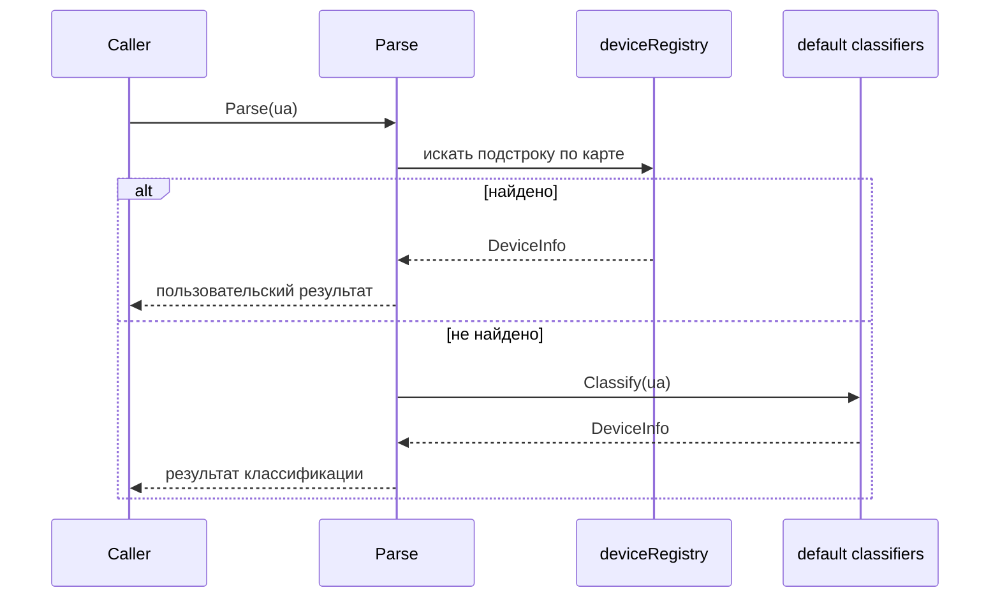

# 📦 device

## Назначение
Высокопроизводительный, не выделяющий память в куче парсер User‑Agent с возможностью добавления пользовательских правил. Определяет тип устройства (Desktop, Mobile, Tablet, Bot), операционную систему и браузер. Подходит для высоконагруженных систем, где каждый запрос должен быть обработан с минимальными накладными расходами.

[Пример применения](/security/device/example/main.go)

## Основные типы и методы

### Классификатор
- **`Classifier[V any]`** – обобщённый классификатор, который ищет подстроку в User‑Agent и сопоставляет её с заданным значением.
- **`NewClassifier[V any]() *Classifier[V]`** – создаёт пустой классификатор.
- **`AddExact(key string, val V)`** – добавляет точное совпадение (использует хеш‑таблицу для O(1)).
- **`AddRule(subString string, val V)`** – добавляет правило частичного совпадения (проверяется по порядку).

### Типы устройств
- **`Type`** – `Desktop`, `Mobile`, `Tablet`, `Bot`, `UnknownDevice`.
- **`OS`** – `Windows`, `MacOS`, `Linux`, `Android`, `IOS`, `UnknownOS`.
- **`Browser`** – `Chrome`, `Safari`, `Firefox`, `Edge`, `Opera`, `IE`, `UnknownBrowser`.
- **`DeviceInfo`** – структура, содержащая `Type`, `OS` и `Browser`.

### Парсинг
- **`Parse(ua string) DeviceInfo`** – основной метод, возвращающий информацию об устройстве. Сначала проверяет пользовательский реестр `deviceRegistry`, затем применяет встроенные классификаторы.
- **`ParseWithClassifiers(ua string, tc, oc, bc) DeviceInfo`** – позволяет передать собственные классификаторы вместо встроенных.

### Реестр пользовательских устройств
- **`RegisterDevice(key string, info DeviceInfo)`** – добавляет запись в глобальный реестр. Если в User‑Agent найдена подстрока `key`, будет возвращён соответствующий `DeviceInfo`.

## Меры предосторожности
- Все функции парсинга **не выделяют память в куче** (zero‑allocation). Возвращаемые структуры передаются по значению.
- Пользовательский реестр (`deviceRegistry`) не защищён мьютексом. Регистрируйте устройства **до** начала вызовов `Parse` (например, в `init()` или при старте приложения).
- Классификатор проверяет правила в порядке их добавления. Более специфичные подстроки должны добавляться раньше общих.

## Диаграмма

