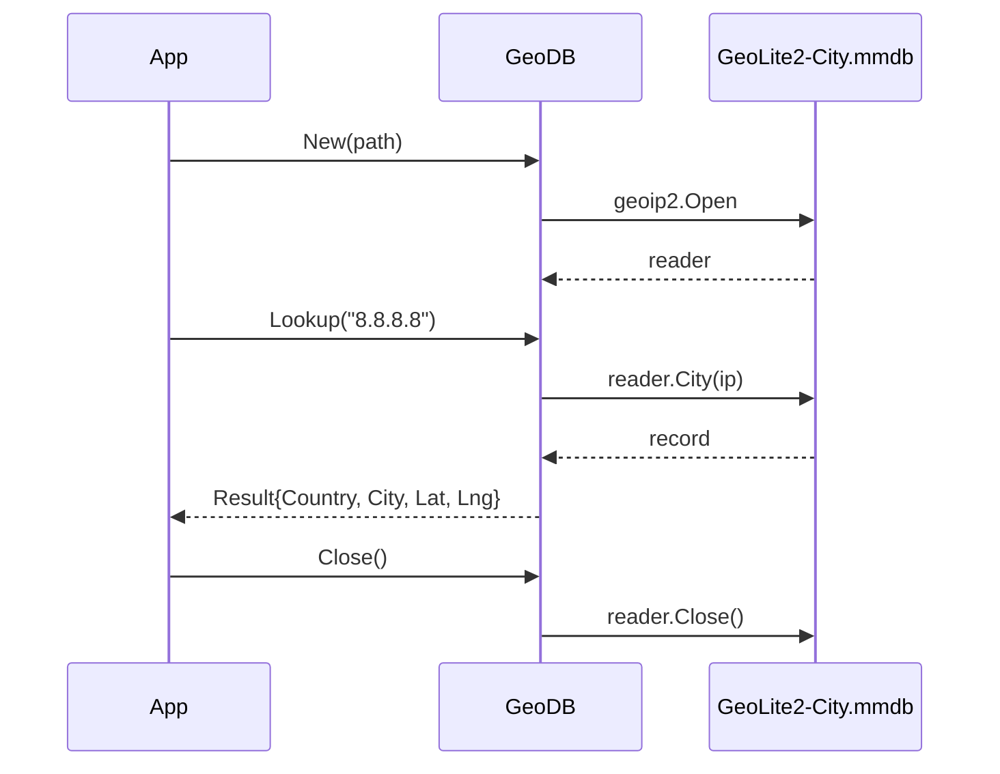

# 📦 geoip

## Назначение
Быстрый in‑memory поиск географической информации по IP‑адресу с использованием базы MaxMind GeoLite2. Позволяет определить страну, город и координаты пользователя, что полезно для гео‑таргетинга, аналитики и безопасности.

[Пример применения](/security/geoip/example/main.go)

## Основные типы и методы

### `GeoDB`
- **`New(path string) (*GeoDB, error)`** – открывает файл базы GeoLite2‑City.mmdb и возвращает готовый к использованию объект.
- **`Lookup(ipStr string) (Result, error)`** – принимает строковое представление IPv4 или IPv6 адреса и возвращает `Result` с гео‑данными.
- **`Close() error`** – освобождает ресурсы, занятые базой.

### `Result`
```go
type Result struct {
    Country string
    City    string
    Lat     float64
    Lng     float64
}
```

## Меры предосторожности
- База данных GeoLite2 **должна** быть предварительно скачана (бесплатно с сайта MaxMind). Без файла `New` вернёт ошибку.
- `GeoDB` **не является** потокобезопасным на уровне открытия/закрытия, но метод `Lookup` можно безопасно вызывать из нескольких горутин (внутренний ридер `geoip2.Reader` поддерживает конкурентное чтение).
- Всегда вызывайте `Close()` при завершении работы, чтобы освободить память и файловые дескрипторы.

## Диаграмма

