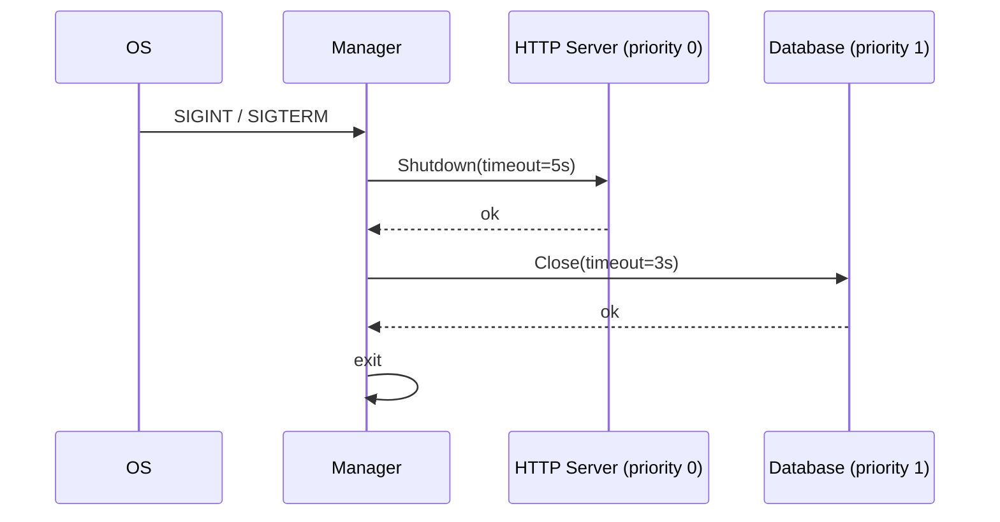

# 📦 shutdown

## Назначение
Корректное (graceful) завершение сервиса с учётом приоритетов и таймаутов. Позволяет зарегистрировать функции закрытия (Closer), которые будут вызваны либо при получении сигнала ОС (SIGINT, SIGTERM), либо при явном вызове `Stop()`.

[Пример применения](/shutdown/example/main.go)

## Основные типы и методы

### `NewManager(totalTimeout time.Duration) *Manager`
Создаёт менеджер с общим таймаутом на весь процесс завершения.

### `(*Manager) SetLogger(l Logger)`
Назначает логгер, который будет получать сообщения о ходе завершения.

### `(*Manager) Add(name string, priority int, fn Closer, timeout time.Duration)`
Регистрирует функцию закрытия.
- `name` – имя для логирования.
- `priority` – чем меньше число, тем раньше будет вызван Closer.
- `fn` – функция, выполняющая закрытие ресурса.
- `timeout` – максимальное время выполнения этой функции.

### `(*Manager) Wait() error`
Блокируется до получения сигнала ОС, затем последовательно вызывает все Closer согласно приоритетам. Возвращает ошибку, если любая из функций завершилась неудачно.

### `(*Manager) Stop() error`
Немедленно запускает все Closer (без ожидания сигнала). Полезно при фатальных ошибках или явном завершении.

## Меры предосторожности
- `Wait()` блокирует горутину навсегда (до сигнала). В тестах или программах без сигналов используйте `Stop()`.
- Если общий таймаут истечёт, оставшиеся Closer будут пропущены.
- Приоритеты обрабатываются строго: сначала выполняются все Closer с приоритетом 0, затем 1 и т.д.

## Диаграмма

