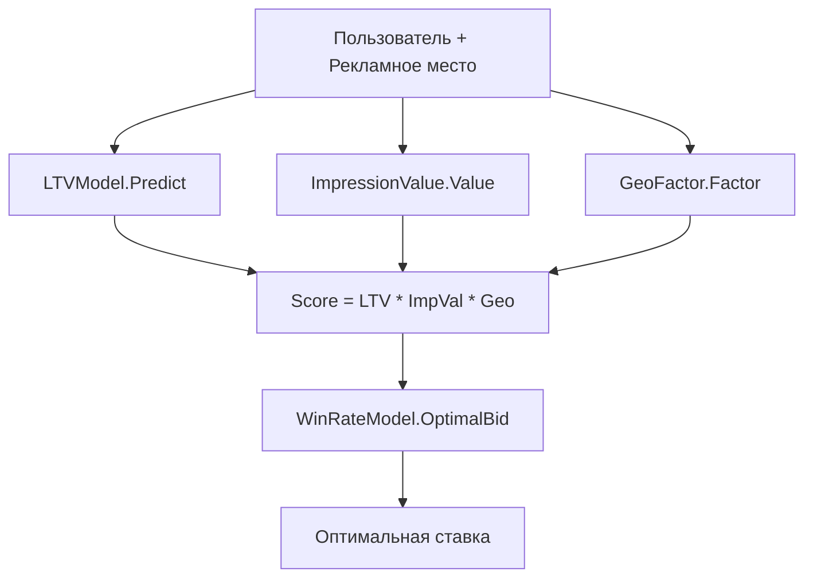

# 📦 valuation

## Назначение
Модели для оценки ценности рекламных показов и оптимизации ставок в системах Real‑Time Bidding (RTB). Пакет объединяет прогнозирование пожизненной ценности пользователя (LTV), оценку ценности одного показа, учёт географического фактора и модель вероятности выигрыша аукциона.

[Пример применения](/valuation/example/main.go)

## Основные типы и методы

### `LTVModel`
- **`NewLTVModel(coeffs []float64) *LTVModel`** – создаёт линейную модель LTV с заданными коэффициентами (первый – смещение, остальные – веса признаков).
- **`Predict(features []float64) float64`** – возвращает прогнозируемую пожизненную ценность пользователя.

### `ImpressionValue`
- **`NewImpressionValue(ctr, cvr, conversionValue float64) *ImpressionValue`** – задаёт базовые вероятности клика (CTR), конверсии (CVR) и ценность одной конверсии (в денежных единицах).
- **`Value(userFeatures, adFeatures []float64) float64`** – вычисляет ожидаемую ценность одного показа как `CTR × CVR × conversionValue`.

### `GeoFactor`
- **`NewGeoFactor(decayRate float64) *GeoFactor`** – устанавливает скорость затухания ценности с расстоянием (в метрах).
- **`Factor(userPos, targetPos geospatial.Point) float64`** – возвращает коэффициент близости (1 при нулевом расстоянии, экспоненциально убывает).

### `WinRateModel`
- **`NewWinRateModel(beta0, beta1 float64) *WinRateModel`** – создаёт логистическую модель вероятности выигрыша.
- **`Probability(price fixedpoint.Money) float64`** – возвращает вероятность выигрыша аукциона при заданной ставке.
- **`OptimalBid(value fixedpoint.Money) (fixedpoint.Money, error)`** – вычисляет ставку, максимизирующую ожидаемую прибыль, методом перебора.

### `Scorer` (составной)
- **`NewScorer(ltv, iv, gf, wrm) *Scorer`** – собирает все модели в один объект.
- **`Score(userPos, targetPos Point, features []float64, baseBid Money) (score float64, optimalBid Money, err error)`** – выполняет полный расчёт скора показа и оптимальной ставки для заданного пользователя и рекламного места.

## Меры предосторожности
- Все денежные величины передаются в минимальных единицах (копейки/центы) через `fixedpoint.Money`. Не смешивайте с `float64`.
- `OptimalBid` выполняет перебор с шагом 1000 единиц, что подходит для большинства валют. При очень больших значениях ставки можно изменить шаг.
- `GeoFactor.Factor` ожидает координаты в градусах и расстояние вычисляет через `geospatial.HaversineDistance`.

## Диаграмма работы скорера

