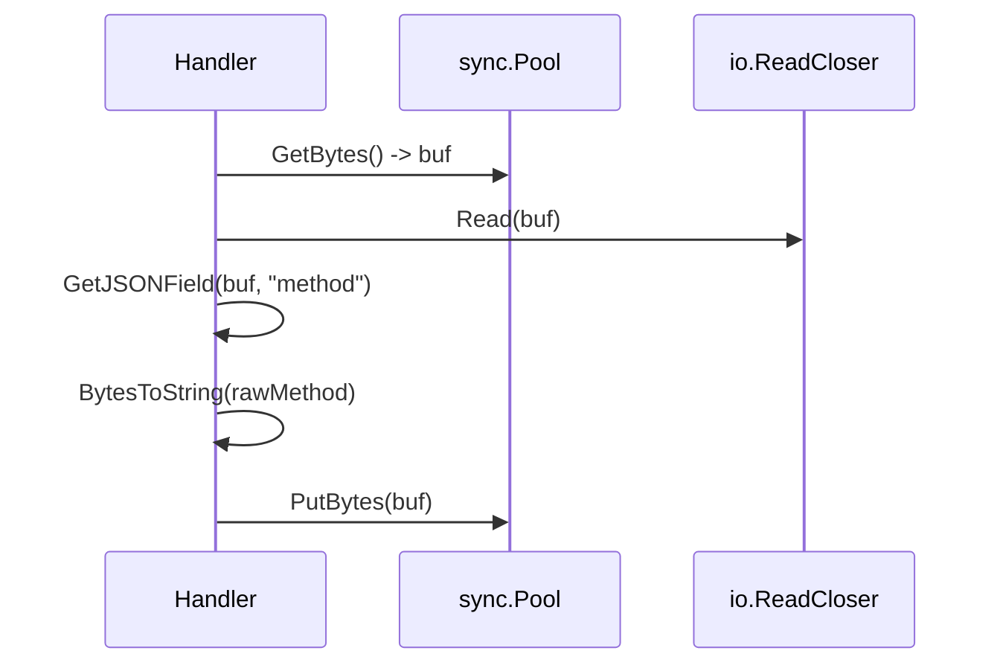

# 📦 zerocopy

## Назначение
Инструменты для работы с байтами и JSON без лишних выделений памяти в куче.  
Пакет предоставляет пул буферов, небезопасные (unsafe) преобразования строк и байт, а также быстрый парсер JSON‑полей без разбора всего документа.

[Пример применения](/zerocopy/example/main.go)

## Основные типы и методы

### Пул буферов
- **`GetBytes() *[]byte`** – берёт буфер из пула (начальная ёмкость 4 КБ).  
- **`PutBytes(buf *[]byte)`** – возвращает буфер в пул после обнуления длины.

### Unsafe‑преобразования (read‑only)
- **`StringToBytes(s string) []byte`** – преобразует строку в слайс байт **без копирования**.  
- **`BytesToString(b []byte) string`** – преобразует слайс байт в строку **без копирования**.  

> ⚠️ **Важно:** Полученные слайсы/строки **нельзя изменять** – это приведёт к неопределённому поведению (повреждению памяти или панике). Используйте эти функции только для временного чтения данных, которые не изменяются.

### Zero‑copy JSON‑парсинг
- **`GetJSONField(data []byte, field string) ([]byte, bool)`** – находит поле в JSON‑объекте и возвращает его сырое значение (включая кавычки для строк) **без аллокаций**. Работает за один проход.

### Помощники для сборки JSON
- **`AppendJSONString(dst []byte, s string) []byte`** – добавляет строку, экранируя кавычки и спецсимволы.  
- **`AppendJSONInt(dst []byte, n int64) []byte`** – добавляет целое число.

## Меры предосторожности
- **Unsafe‑функции** являются опасными: используйте их только если уверены, что исходные данные не будут изменены.
- Пул буферов `sync.Pool` может вернуть буфер с произвольной ёмкостью; всегда проверяйте длину после получения.
- `GetJSONField` ожидает корректный JSON‑объект; на повреждённых данных может работать неверно.

## Диаграмма работы пула буферов и парсинга JSON

